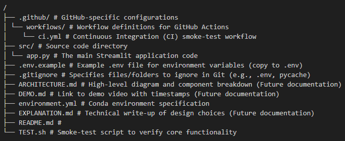

# 👨‍🍳 Chiller - Smart AI Recipe Suggester 🥦

## Project Overview

Chiller is an intelligent AI-powered recipe assistant designed to help you discover delicious recipes using the ingredients you already have. Simply upload an image of your ingredients (e.g., contents of your fridge or pantry), and Chiller leverages the power of the Google Gemini 1.5 Flash model to identify them and then suggest creative, simple recipes tailored to what's available.

This project was developed as part of a hackathon, focusing on rapid prototyping, secure API handling, and automated testing.

## Features

*   **Ingredient Identification:** Upload an image, and Gemini Vision AI identifies food items.
*   **Recipe Generation:** Get 3 creative and simple recipe suggestions based on your identified ingredients.
*   **Step-by-step Instructions:** Each recipe comes with a brief description, main ingredients used, and clear preparation instructions.
*   **Streamlit Interface:** A user-friendly web interface for easy interaction.
*   **Secure API Key Handling:** Integrates `python-dotenv` for local environment variable management.
*   **Automated Testing:** Basic smoke tests and Continuous Integration (CI) setup with GitHub Actions.

## Project Structure

The project is organized into the following logical structure:



## Setup Instructions

### Prerequisites

Before you begin, ensure you have the following installed:

*   **Git:** For cloning the repository.
*   **Conda (or Miniconda):** Recommended for managing Python environments locally. Download from [conda.io/miniconda](https://docs.conda.io/en/latest/miniconda.html).
*   **Google Gemini API Key:** You'll need an API key from Google AI Studio. Visit [aistudio.google.com/app/apikey](https://aistudio.google.com/app/apikey) to generate one.

### Clone the Repository

First, clone the project to your local machine:

```bash
git clone https://github.com/mariamafra/Paas_The_Coffee.git 
cd Paas_The_Coffee
```

Using Conda (Recommended for Local Development)

*   Initialize Conda (if you haven't already): If this is your first time using Conda or you encounter issues with `conda activate`, run:

```bash 
conda init 
```

Then, **close and reopen your terminal** for the changes to take effect.

## Running Locally

### Create and Activate the Conda Environment:

```bash
conda env create -f environment.yml
conda activate chiller-env
```

This will install all necessary Python dependencies, including streamlit, google-generativeai, Pillow, and python-dotenv.

### Configure your Gemini API Key: For local development, we use a .env file to securely store your API key.

*   Create a .env file: Copy the example file:
```bash 
cp .env.example .env
```

*    Edit .env: Open the newly created .env file and replace "YOUR_ACTUAL_GEMINI_API_KEY_HERE" with your actual Google Gemini API Key:
```bash 
GEMINI_API_KEY="your_actual_google_gemini_api_key_here"
```

### Launch the Streamlit application:

```bash 
streamlit run src/app.py
```
Your terminal will display a local URL (e.g., `http://localhost:8501`) and a network URL. Open the local URL in your web browser to access the "Chiller" interface.


## Usage Instructions
### Once the Streamlit application is running in your browser:

1. **Upload Image:** Click the "Upload an image of your ingredients" button and select a photo containing food items.

2. **Analyze:** The app will analyze the image using Gemini Vision AI to identify the ingredients.

3. **Get Recipes:** After identification, Chiller will generate and display 3 creative recipe suggestions based on the identified ingredients, complete with descriptions, ingredient lists, and preparation steps.


## Dependencies
### The core dependencies for this project are managed via environment.yml and include:

* **streamlit:** For building the interactive web interface.
* **google-generativeai:** The official Google Gemini API client library.
* **Pillow:** For image processing (used by PIL.Image).
* **python-dotenv:** For loading environment variables from a .env file locally.